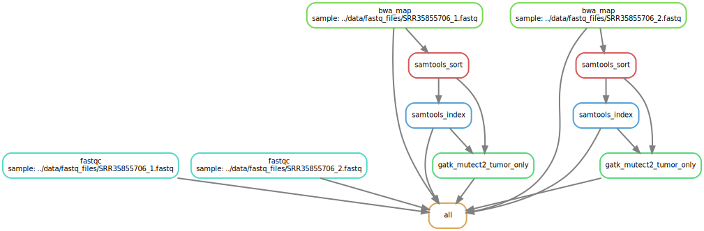
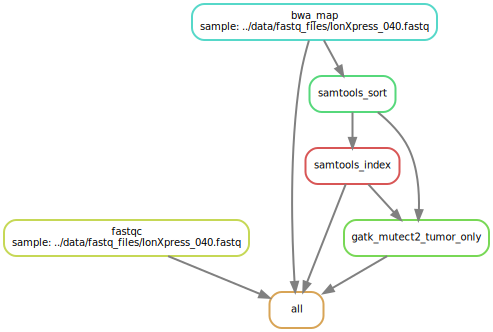

# PYpeline
**A lightweight and modular NGS pipeline from FASTQ → BAM → VCF**, designed for small projects and rapid iteration.

This pipeline automates the essential steps of variant analysis, including:
- Trimming (TrimGalore)
- Quality control (FastQC + MultiQC)
- Read alignment (BWA MEM)
- Sorting and indexing (Samtools)
- Variant calling (Mutect2)

It supports **Single-End (IonTorrent, AmpliSeq)** and **Paired-End (Illumina)** FASTQ files automatically.

## Directory Structure
Before running the pipeline, organize your data as follows:

```markdown
data/
├── fastq_files/      # FASTQ input files
├── bed/              # BED files for target regions (optional)
└── references/       # Reference genome files (FASTA + indexe files for BWA MEM and Mutect2)

workflow/
├── envs/             # Environment .yaml files
├── config.yaml       # Configuration file where the user sets the pipeline parameters and file paths
├── Snakefile         # Main workflow file              
└── functions.smk     # Python functions to get input files

results/              # Output files will be written here
```
- **FASTQ files:** Input sequencing reads.  
- **BED files:** Target regions for variant calling (optional).  
- **References:** Reference genome files including any required index files for `bwa mem` and `Mutect2`.

## Running the pipeline
First, edit the `config.yaml` file to decide pipeline parameters and to **inform FASTQ file paths**.

Then run:
```markdown
snakemake --use-conda --cores 8
```
If you would like to use all available cores in your machine, use:
```markdown
snakemake --use-conda --cores
```

Generate a DAG diagram showing the workflow:
```markdown
snakemake -np --use-conda --dag | dot -Tsvg > dag.svg
```

## Output structure
After processing, results are written to:
```markdown
results/
├── trimmed_fastq/    # FASTQ files after trimming
├── fastqc/           # QC reports (per sample + MultiQC)
├── mapped_reads/     # Unsorted BAM
├── sorted_reads/     # Sorted BAM and BAI files
├── variant_calls/    # `.vcf` files
└── logs/             # Execution logs for troubleshooting
```

## Requirements
- Conda / Mamba
- Snakemake ≥ 7.x
- Python = 3.12.11

Install Snakemake via Conda:
```bash
conda install -c conda-forge -c bioconda snakemake
```

## Example Workflow DAG

Pair-end sequencing FASTQs (Illumina):



Single-read sequencing FASTQs (Ion Torrent):

