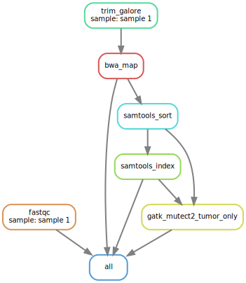
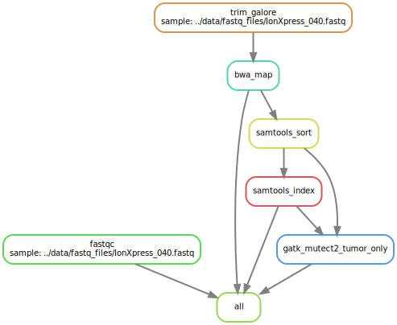
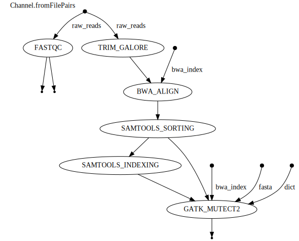

# PYpeline
**A lightweight and modular NGS pipeline from FASTQ → BAM → VCF**, designed for small projects and rapid iteration.\
Available in both `Snakemake` and `Nextflow`.

This pipeline automates the essential steps of variant analysis, including:
- Trimming (TrimGalore)
- Quality control (FastQC + MultiQC)
- Read alignment (BWA MEM)
- Sorting and indexing (Samtools)
- Variant calling (Mutect2)

It supports **Single-End (IonTorrent, AmpliSeq)** (_Snakemake only_) and **Paired-End (Illumina)** FASTQ files automatically.

## Quickstart (TL;DR)

- Clone the repo:
```bash
git clone https://github.com/Roxicaro/Pypeline.git
cd Pypeline
```
- Install requirements: Docker, Snakemake / Nextlow
- Prepare `data/` directory (FASTQs + reference)
- Edit `workflow/config.yaml` (Snakemake) or `nexflow.config` (Nexflow)
- Run


## Directory Structure
Before running the pipeline, organize your data as follows:

### Snakemake
```markdown
data/
├── fastq_files/      # FASTQ input files
├── bed/              # BED files for target regions (optional)
└── references/       # Reference genome files (FASTA + indexe files for BWA MEM and Mutect2)

workflow/
├── envs/             # Environment .yaml files
├── config.yaml       # Configuration file where the user sets pipeline parameters and file paths
├── Snakefile         # Main workflow file              
└── functions.smk     # Python functions to get input files

results/              # Output files will be written here
```

### Nextflow
```markdown
data/
├── fastq_files/      # FASTQ input files
├── bed/              # BED files for target regions (optional)
└── references/       # Reference genome files (FASTA + indexe files for BWA MEM and Mutect2)

root/
├── envs/             # Environment .yaml files
├── main.nf           # Main workflow file              
└── nextflow.config   # Configuration file where the user sets pipeline parameters and file paths

results/              # Output files will be written here
```


- **FASTQ files:** Input sequencing reads.  
- **BED files:** Target regions for variant calling (optional).  
- **References:** Reference genome files including any required index files for `bwa mem` and `Mutect2` _(.fa / .fai / .dict / .amb / .ann / .bwt / .pac / .sa)_.

## Running the pipeline
First, edit the `config.yaml` (Snakemake) or `nextflow.config` (Nextflow) file to decide pipeline parameters and to **inform FASTQ file paths**.

### Using Docker with Snakemake (local):
```markdown
docker run -it --rm \
  -v $PWD:/pipeline \
  -w /pipeline/workflow \
  roxicaro/pypeline-snakemake \
  snakemake --cores 4
```
`--cores` specifies the number of cores to be used.

### Using Docker with Nextflow:
**Local:**
```markdown
nextflow run main.nf -profile docker
```
**AWS Batch:**
```markdown
nextflow run main.nf -profile aws_batch -bucket-dir s3://<s3-bucket-name>/
```

### Generate a DAG diagram showing the workflow (Snakemake):
```markdown
docker run -it --rm \
  -v $PWD:/pipeline \
  -w /pipeline/workflow \
  roxicaro/pypeline-snakemake \
  snakemake -np --dag | dot -Tsvg > dag.svg
```

## Output structure
After processing, results are written to:
```markdown
results/
├── trimmed_fastq/    # FASTQ files after trimming
├── fastqc/           # QC reports (per sample + MultiQC)
├── mapped_reads/     # Unsorted BAM
├── sorted_reads/     # Sorted BAM and BAI files
├── variant_calls/    # `.vcf` files
└── logs/             # Execution logs for troubleshooting
```

## Requirements
- [Docker](https://www.docker.com/get-started/)
- [Snakemake](https://snakemake.github.io/) / [Nextflow](https://github.com/nextflow-io/nextflow)

## Example Workflow DAG (Snakemake)

Pair-end sequencing FASTQs (Illumina):



Single-read sequencing FASTQs (Ion Torrent):



## Example Workflow DAG (Nextflow)

